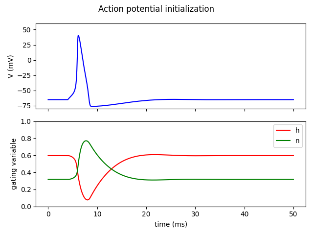
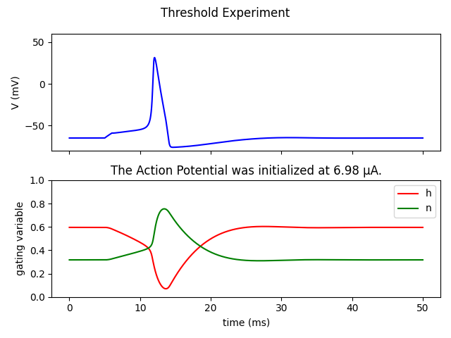
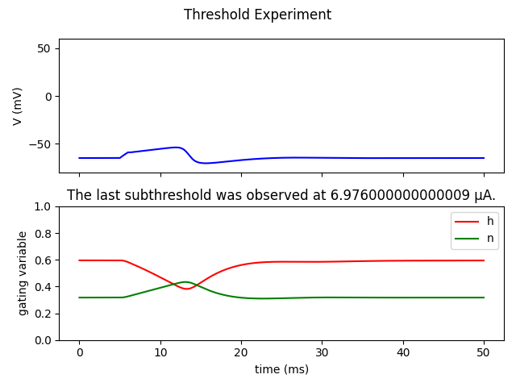
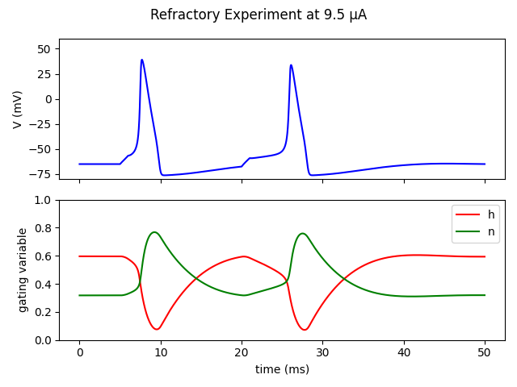
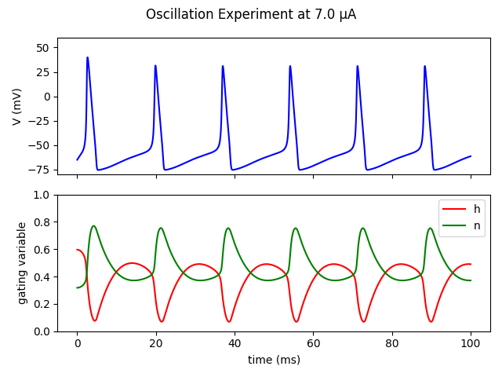
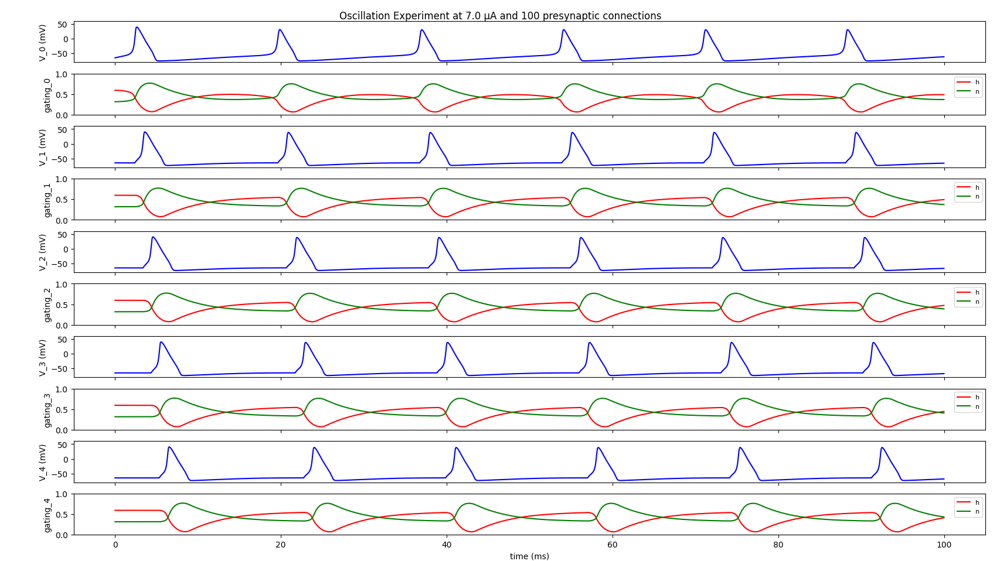

# Hodgkin Huxley Action Potential

[](https://doi.org/10.5281/zenodo.20284016)

This is my first computational neuroscience project — a Python implementation of the 1952 Hodgkin and Huxley paper on action potential generation in neurons. The biophysical equations follow the paper; the implementation, debugging, and experimental analysis are my own. The project was structured around an exercise sheet that decomposed the paper into sequential milestones. I have reproduced all of the experiments from the paper on a single neuron and am currently extending the work to a chain of HH neurons connected by AMPA-like synapses, in order to study propagation latency and the conditions under which synaptic transmission succeeds or fails.

**Language:** Python 3.14.0 (Matplotlib, Numpy)
**Reference:** Hodgkin AL, Huxley AF (1952). A quantitative description of membrane current and its application to conduction and excitation in nerve. Journal of Physiology 117:500–544. [(DOI)](https://doi.org/10.1113/jphysiol.1952.sp004764)

## Shared modules:

### rate_constants

The `rate_constants.py` calculates the opening and closing rate of the three type of gates (sodium-activated -> m, sodium-inhibited -> h, potassium-activated -> n). 
These constants are then used to calculate the steady-state and time constants later on. L'Hôpital's rule was used to avoid removable singularity cases for alpha_m and 
alpha_n -> A solution that checks the current voltage and returns a hardcoded value. 

### steady_state

The `steady_state.py` contains the functions that calculate the steady state values of each gate and the timeframe in which they open/close, derived from the rate constants by setting dx/dt = 0.

### gating_ODEs

The `gating_ODEs.py` calculates the gating variable ODEs for m, h and n, which will later be used in `dynamical_system.py`.

### ionic_channels

The `ionic_channels.py` computes the three ionic currents (sodium, potassium, leak) as functions of voltage and the current gating variable values, using the channel formulations from the paper (m^3 * h for sodium n^4 for potassium).

### dynamical_system

`dynamical_system.py` calculates the current state (V, m, h, n) and returns the four derivatives dV/dt, dm/dt, dh/dt and dn/dt. It also calculates internally the injected current
by the experiment-conductor.

### forward_euler

`forward_euler.py` calculates the current state by invoking `dynamical_system.py` on every dt step (0.01ms for testing). It stores the history of the experiment into `V_history`, `t_history`, as well as `m_history`, `h_history` and `n_history` inspired by Hodgkin-Huxley's paper, which tracked the gap by observing the h (sodium inactivation gates) and n (potassium conductance) during the firing of an action potential, which this project shows in action. The sodium inactivation and potassium conductance are tracked and plotted alongside the APs, the final product closely resembles the graph (Fig 19) in the paper.

### Plotting
`plot.py` holds the plotting function.

### Testing

`testing.py` validates the core modules `rate_constants.py`, `steady_state.py`, `ionic_channels.py`, `gating_ODEs.py` and `dynamical_system.py`. The validation is done at at a resting membrane voltage (-65mV), where the output of each formula is compared with the expected values. The outputs of each script are grouped in dictionaries (if more than 1 output is tested) and each directory is checked for 'False' values. If any 'False' values exist, a second dict is created in which only the False occurences are stored and that dictionary is printed, showing the user exactly which key-value pairs contain 'False'. 

## Single Neuron Experiments:

### Action Potential Experiment



*An action potential generated by the model in response to a current pulse (10 μA/cm^2, injected for 2ms). Note: This graph matches the HH 1952's Fig 19 accurately*

`action_potential.py` initiates an action potential in a single neuron by injecting a current impulse of 10 microamps for 2ms.

### Threshold Experiment



*The initialization of an action potential as a result of passing the pulse threshold (6.98 µA/cm^2, injected for 1ms)*

`threshold.py` iterates through increments of the injected µA in range 0 to 10 in order to find the µA value at which the action potential is initialized. `np.arange` is used for fine
iteration (several digits after the decimal point).

### Subthreshold Experiment



*A subthreshold response observed when the membrane potential is less than the threshold for setting up a spike. It is apparent that the potassium conductance and sodium reserves were not enough for an AP to fire.*

`subthreshold.py` finds the µA that generates the last subthreshold before a real AP can be fired. The iteration follows the same logic as `threshold.py`, but it retrieves the subthreshold that predates the AP threshold and is then used to generate the subthreshold plot.

### Refractory Period Experiment



*Refractory period observed within a 15ms gap after the previous action potential generated at 9.5 μA/cm^2, marked by the delayed rise of potassium conductance and slow sodium recovery after the first AP.*

`refractory_period.py` conducts an experiment which aims to discover the timeframe in which a second AP can be generated after the initial AP. This experiment demonstrates that potassium conductance reaches resting levels after an AP and that the sodium channels must recover from inactivation (h returning to near-rest values) before another AP can fire.

### Oscillation Experiment



*Oscillation occured under a constant current of 7 μA/cm^2*

`oscillation.py` applies a constant current to the forward Euler model, demonstrating the different frequency of action potentials fired at different constant microamps injected into the neuron.

## Key observations:

- The threshold for a 1 ms pulse is ~6.98 μA/cm^2, with an all-or-nothing transition characteristic of AP dynamics. This is further demonstrated by the subthreshold experiment.
- The refractory period at near-threshold stimuli is dominated by slow recovery of h (sodium inactivation gate) and slow decay of n (potassium activation) following a previous AP, matching Hodgkin-Huxley 1952's observations.
- The second firing in the refractory experiment matches the curve of the threshold firing experiment, which indicates that the resources were barely enough for that AP to occur - the sodium and potassium reached the levels needed for an AP to fire, however the 9.5 μA were just enough for the AP to fire. Anything less would have resulted in a subthreshold graph instead.
- In the oscillation experiment, sustained currents below 6 μA produce only a transient response (one or two APs followed by a membrane voltage at rest), while sustained currents at or above 7 μA produce continuous repetitive firing. The major difference between these two firing modes is characteristic for Type II neurons.

## Multi-neuron Experiments:

### Custom Forward Euler:

The `forward_euler.py` in the `chain` folder takes the forward euler scheme and applies it to N neurons. A few new constants have been implemented: `s`, `E_syn`, `V_post` and `I_syn`, where `s` is the synapse update rule and is saturated at 1 (min(s+1,1)) when a spike is detected and is at constant exponential decay despite the spikes (ds/dt = −s/τ_syn). `E_syn` is the synaptic reversal potential, and for excitatotry AMPA-like synapses is equal to 0 mV. `V_post` holds the postsynaptic membrane voltage and `I_syn` is the current that is being received by the postsynaptic neuron. For excitatory AMPA synapses where `E_syn` = 0 mV and `V_post` is about -65 mV at rest, `I_syn` will be a negative number. This matters, because when applied in the `dynamical_system.py`, it is subtracted from the other currents. Subtracting a negative number results in a positive contribution - leading to the depolarization of the postsynaptic neuron. 
The first loop goes through the time steps and the nested loop applies the calculations to each neuron. Only the first neuron in the chain of neurons receives external drive, the rest receive synaptic output from their predecessor. After each variable has been updated, we check for a spike and we update s. We return the histories for each neuron for visualization. 

### Synaptic model

`synaptic_model.py` holds the constants and functions related to the synapses. The first constant is the single synapse conductance `g_syn`, which is calculated by the multiplication of `N` (number of synaptic connections, which is the range 10...100 for AMPA-like synapses) and `y` (single channel conductance in picosiemens, which is converted in milisiemens for the equations to work properly). 
The second constant is `G_total` and it tells us how many synapses contribute. It is the product of multiplication of `N_syn` (number of presynaptic neurons connected to the postsynaptic cell) and the single synapse conductance - for each synaptic connection, what is the synaptic conductance. For a 1-to-1 neural chain, `N_syn = 1`, for a more realistic chain, `N_syn = 100...10000`. 
The third constant is the density of the synaptic conductance - `g_syn_density`. It is the division of `G_total` with `A_membrane` (the area of the membrane). To calculate `A_membrane` we will use the radius of a large axon, which is 25 micrometers or 0.0025 centimeters (we are using square centimeters in the HH equations) and calculate `A_membrane` by using the sphere surface area formula: 4 * π * r^2. `g_syn_density` is used in `multi_FE.py` to compute the received current from the presynaptic neuron. 
The final constant is tau_syn, which is the time constant for synaptic gating decay equal to 5 ms. 
The two functions in `synaptic_model.py` are `detect_spike`, which takes the current and previous addition to the V_history and checks if they are both above 0 mV (which would mean that a spike is underway), and `update_synapse` which updates `s` if a spike is underway, otherwise keeps it a constant decay.  

### Multi-neuron Oscillation Experiment:



*Oscillation occured under a constant current of 7 μA/cm^2 where N = 5 and N_syn = 100*

The chain `oscillation.py` conducts the oscillation experiment on N neurons and visualizes V, h and n. 

## How to run:

```
git clone https://github.com/hamii31/Hodgkin_Huxley_Action_Potential.git
pip install matplotlib numpy

# to reproduce a single action potential in a single neuron
python -m single.action_potential.py

# to reproduce the threshold experiment in a single neuron
python -m single.threshold.py

# to reproduce the subthreshold experiment in a single neuron
python -m single.subthreshold.py

# to reproduce the refractory experiment in a single neuron
python -m single.refractory_period.py

# to reproduce the oscillation experiment in a single neuron
python -m single.oscillation.py

# reproduce the oscillation experiment in a chain of neurons
python -m chain.oscillation.py
```

## License

MIT License
