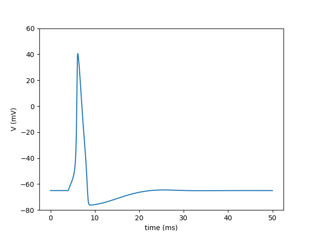
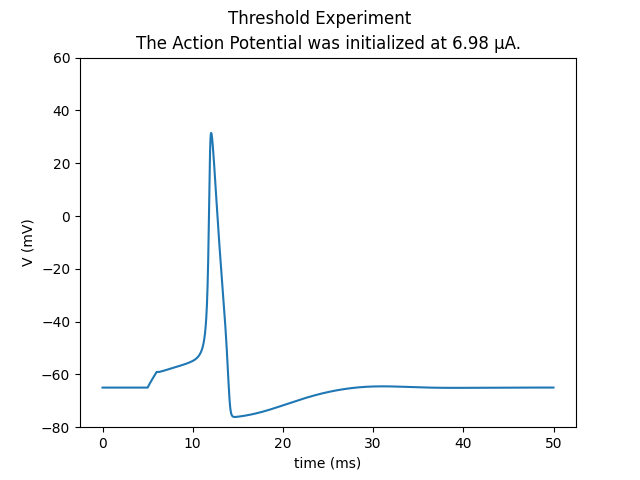
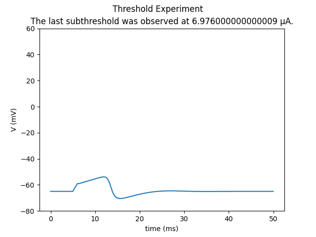

# Hodgkin Huxley Action Potential

This is my implementation of the 1952 Hodgkin and Huxley paper describing the generation of action-potentials in neurons. 



*An action potential generated by the model in response to a current pulse (10 μA/cm^2, injected for 2ms)*



*The initialization of an action potential as a result of passing the pulse threshold (6.98 µA/cm^2, injected for 1ms)*



*A subthreshold response observed when the membrane potential is less than the threshold for setting up a spike*

**Language:** Python 3.14.0 (Matplotlib, Numpy)
**Reference:** Hodgkin AL, Huxley AF (1952). A quantitative description of membrane current and its application to conduction and excitation in nerve. Journal of Physiology 117:500–544. [(DOI)](https://doi.org/10.1113/jphysiol.1952.sp004764)

## What has been implemented so far:

### rate_constants

The `rate_constants.py` calculates the opening and closing rate of the three type of gates (sodium-activated -> m, sodium-inhibited -> h, potassium-activated -> n). 
These constants are then used to calculate the steady-state and time constants later on. L'Hôpital's rule was used to avoid removable singularity cases for alpha_m and 
alpha_n -> A solution that checks the current voltage and returns a hardcoded value. 

### steady_state

The `steady_state.py` contains the functions that calculate the steady state values of each gate and the timeframe in which they open/close, derived from the rate constants by setting dx/dt = 0. This script demonstrates the different timing of each gate, which is necessary for the action-potentials. 

### gating_ODEs

The `gating_ODEs.py` calculates the gating variable ODEs for m, h and n, which will later be used in `dynamical_system.py`.

### ionic_channels

The `ionic_channels.py` computes the three ionic currents (sodium, potassium, leak) as functions of voltage and the current gating variable values, using the channel formulations from the paper (m^3 * h for sodium n^4 for potassium).

### dynamical_system

`dynamical_system.py` calculates the current state (V, m, h, n) and returns the four derivatives dV/dt, dm/dt, dh/dt and dn/dt. It also calculates internally the injected current
by the experiment-conductor.

### forward_euler

`forward_euler.py` combines everything into a working action-potential generating model, that calculates the current state by envoking `dynamical_system.py` on every dt step (0.01ms
for testing). It stores the history of the experiment into `V_history` and `t_history`, which are later plotted into a figure for visual demonstration of the action-potential.

### Threshold for firing

`threshold.py` iterates through increments of the injected µA in range 0 to 10 in order to find the µA value at which the action potential is initialized.

### Testing

`testing.py` which conducts tests on various functions in the project. The validation is done at at a resting membrane voltage (-65mV), where the output of each formula is put againts the expected values. The outputs of each script are grouped in dictionaries (if more than 1 output is tested) and each directory is checked for 'False' values. If any 'False' values exist, a second dict is created in which only the False occurences are stored and that dictionary is printed, showing the user exactly which key-value pairs contain 'False'. 


## What is yet to be implemented:

- A function that finds the refractory period

## How to run:

```
git clone <repo>
pip install matplotlib
python forward_euler.py
```

## License

MIT License
